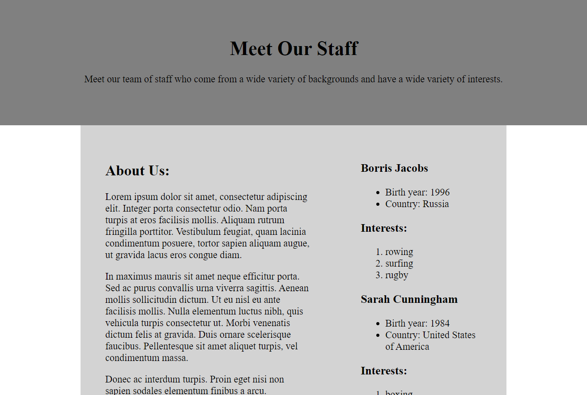

Web Homework Task 02
==========

In this task you will use JavaScript and CSS Grid to display the content included in the HTML and JavaScript files as shown in this screenshot.

Importantly, in this task, you will use JavaScript to display the staff details contained in the `staffDetails` array within the `task.js` JavaScript file. You will also use CSS Grid so that the 'About Us' section and staff details are contained in two separate columns. 

You have been supplied with the basic HTML content and JavaScript content to get started but you will have to write much of your own JavaScript, HTML and CSS.

Tasks: 

1. Create the necessary CSS code to create a CSS Grid that will display the content as per the image above. The header should spread the width of the page, the `left` and `right` column divs that display content below the header should be spaced similarly to the image above: the left and right divs should be three and two fifths respectively. There should also be blank space on the left and right of the content as shown in the image above; this should also be created with CSS Grid. Add other CSS code as required so that the content displays similar to the image above. Note that the content of the right div will be created by JavaScript in the next step.

2. Create then necessary JavaScript code to display the content from the `staffDetails` JavaScript array within the right div as shown in the image above. This should loop through all JavaScript objects in the `staffDetails` array. The name of the staff member and `Interests:` should be `h3` elements. The birth year and country should be displayed with an unordered list and the interests should be displayed with an ordered list. Because interests is a nested array of unknown size you will need to use a nested loop (a loop within a loop) or similar to display the content. 

3. Add the necessary CSS so that when the page is less than 500 pixels in width the left and right divs will become a single column with the left div displayed first at the top and the right div displayed below it. The best way to achieve this is with an appropriate media query that contains the CSS grid code that relates to screens less that 600 pixels in width.       

